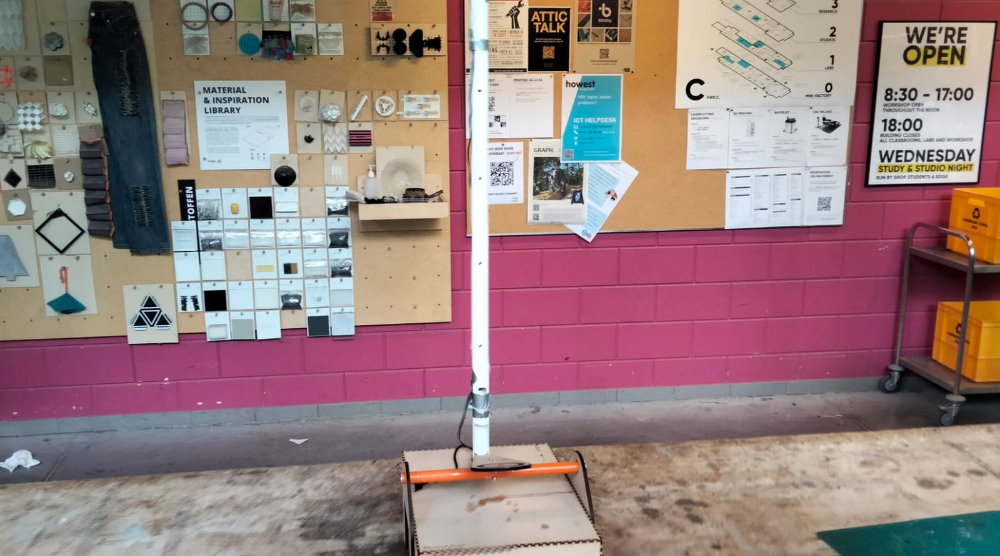
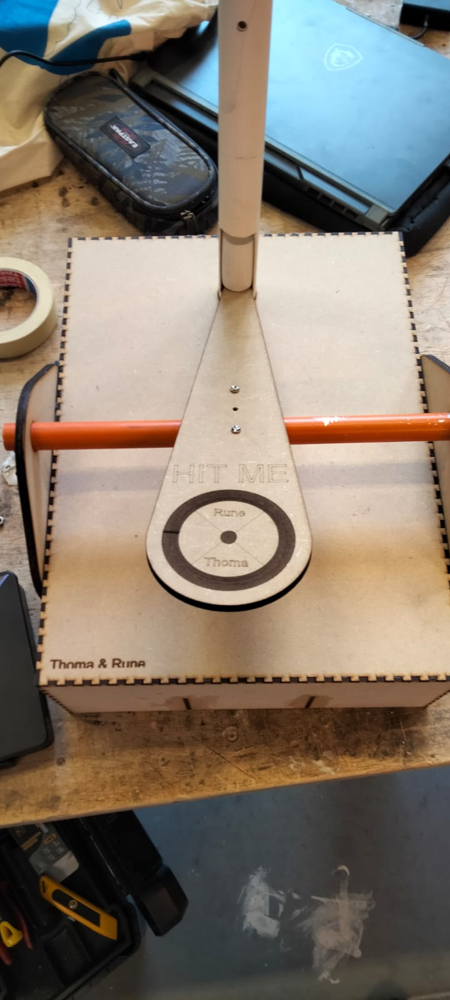
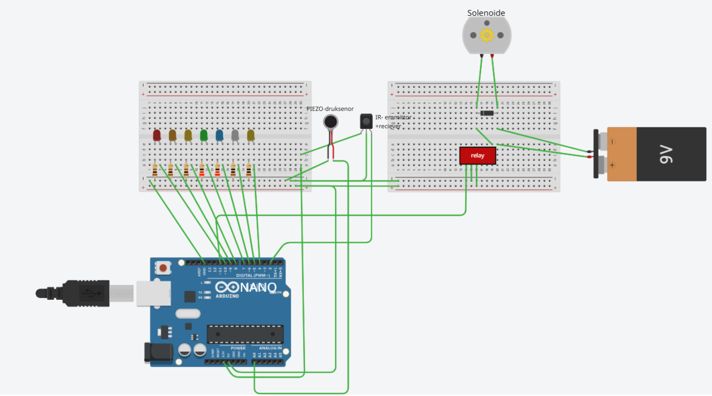

# Kop van Jut

## Doel
Prototype it! Visualize it!
We ontwerpen en bouwen een variant van de klassieke “Kop van Jut”-attractie.

## Proces & Creativiteit
We onderzochten verschillende manieren om de kracht van een slag te meten:

**Piezo sensor**: bleek ongeschikt omdat deze enkel impact detecteert, maar geen daadwerkelijke kracht meet.

**Load cell**: ideaal in theorie, maar de benodigde HX711 versterker is te traag om een korte impact te registreren. Bovendien is het signaal te zwak voor directe meting met een Arduino, wat leidt tot lage nauwkeurigheid.

**Accelerometer**: technisch complex door meerdere bewegingsrichtingen. Daarnaast zou het ook de klap zelf detecteren, wat onnauwkeurig is. Tot slot zorgt lange bekabeling voor risico’s op vertraging of storing.

## Oplossing / Werking prototype
### Prototype

### Meetsysteem: 
In plaats van krachtmeting kozen we voor een tijdmeting gebaseerd op hoogte:

Een gewichtje wordt omhoog geslagen via een wipmechanisme.

Een IR proximity sensor meet de hoogte op een bepaald punt.

Helemaal bovenaan zit een piezo sensor die detecteert of het gewichtje het einde bereikt (topscore).

### Feedbacksysteem:

LEDs geven visuele feedback afhankelijk van de behaalde hoogte/tijd.

Indien de piezo bovenaan geactiveerd wordt, gaat er een bel af via een solenoïde, wat auditieve feedback geeft.

## Schakeling arduino

